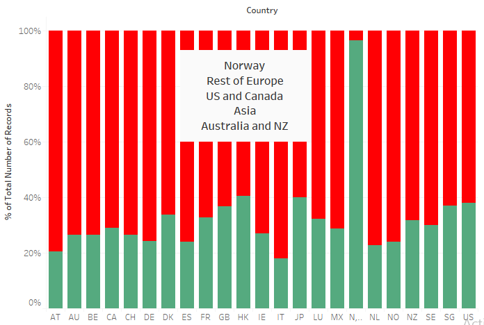
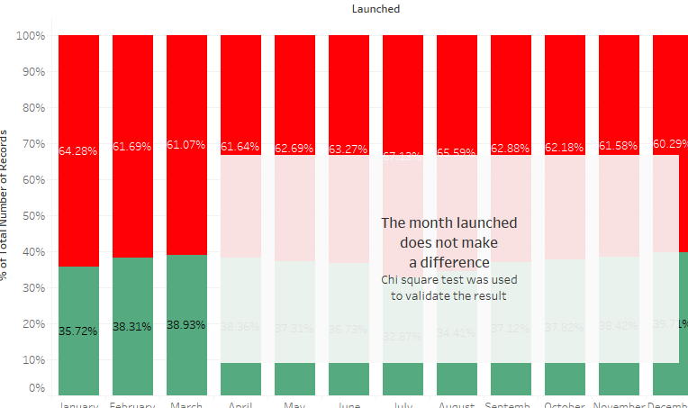
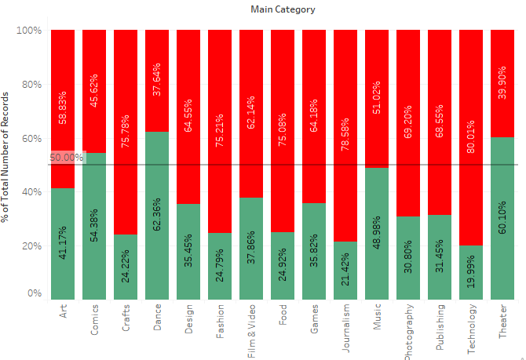
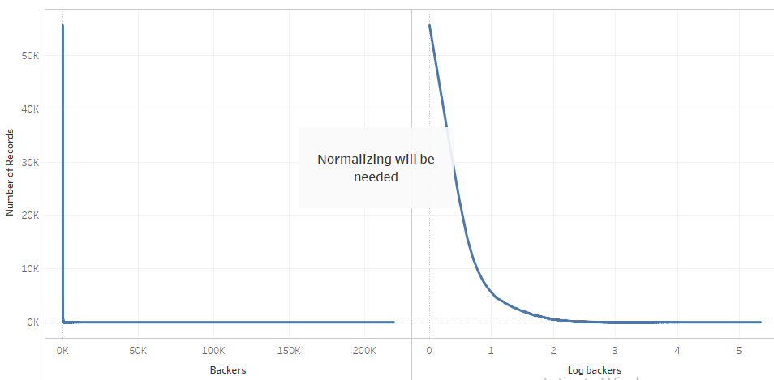

# Kickstarter
A dataset that required high maintenance through cleaning and EDA

Kickstarter is an American public-benefit corporation based in Brooklyn, New York, that maintains a global crowdfunding platform focused on creativity and merchandising. The company's stated mission is to "help bring creative projects to life". Kickstarter has reportedly received more than $1.9 billion in pledges from 9.4 million backers to fund 257,000 creative projects, such as films, music, stage shows, comics, journalism, video games, technology and food-related projects.
People who back Kickstarter projects are offered tangible rewards or experiences in exchange for their pledges. This model traces its roots to subscription model of arts patronage, where artists would go directly to their audiences to fund their work.

I found this dataset on kaggle and when I went through the data I found out that the dataset needed a lot of cleaning to be done. I have shown my approach to this project step by step below.

The goal is to undersstand the difference values in categorical variables, the distribution of numerical variables, Patterns and some insights from the dataset.

## 1.Exploratory Data Analysis (EDA)

I used Tableau to visualize and understand this dataset. I will then use this insight to add or remove features for predicting the outcome.

**1.1 Percentage of success**

- The image shows that a project is 2 times more likely to fail than to succeed.

**1.2. Pledged, Goal**

- More users who have pledged more have succeeded and more users who've had higher goals have failed.

**1.3. Country**

- People from 'No' or Norway have a higher success to failure ratio than the other countries. To reduce the variables in countries, we can merge certain countries with less number of occurences togeather.

**1.4. Currency**

- Since US has the highest number of users, USD is the most used currency. To gerneralize the other variables, goal and pledged of other currencies can be converted to USD.

**1.5. Month**

- All months have almost equal distribution and therefore believe that this variable would not affect the data.
- To confirm this, I applied Chi Squared test on the variables and the test was favourable.

**1.6. Launched Year**

- All years have almost equal distribution and therefore believe that this variable would not affect the data.
- To confirm this, I applied Chi Squared test on the variables and the test was favourable.

**1.7. Gap of Year**

- I created a new variable which is the difference between the deadline year and the launch year. This variable too proves that it does not have any affect on the final output.

**1.8. Main Category**

- Dance, Theatre and Comics had a higher success to failure ratio than the other genres.
- Technology, Crafts, Journalism had a higher failure rate

**1.9. Backers**

-Normalizing will be needed

**1.10. Pledged,goal**

**1.11. Outliers**

- The outliers should be treated seperately. They can be imputed using th emean, mode, median or using an iterative approach if the decision is too complicated.

